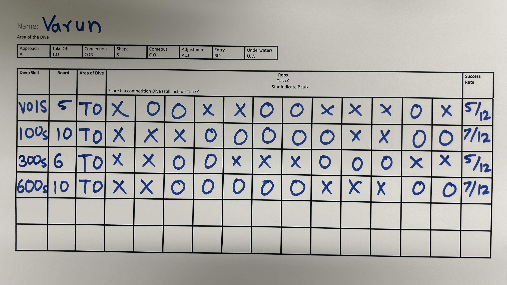
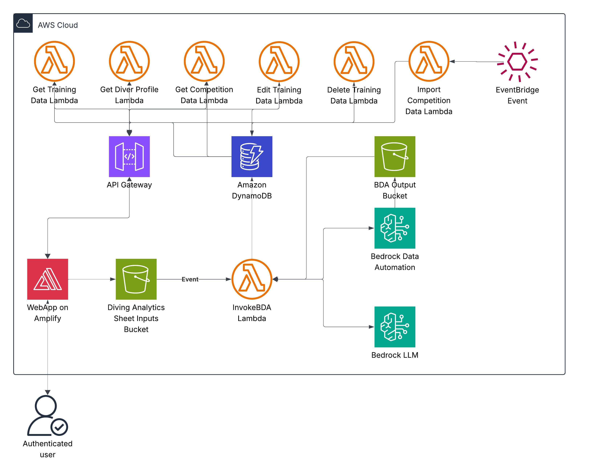

# Diving Analytics Platform

| Index                                             | Description                                                             |
|:--------------------------------------------------|:------------------------------------------------------------------------|
| [Overview](#overview)                             | See the motivation behind this project                                  |
| [Description](#description)                       | Learn more about the problem, implemented solution and challenges faced |
| [Deployment Guide](#deployment)                   | How to install and deploy **Diving Analytics Platform**                 |
| [How to Use](#how-to-use)                         | Instructions to use **Diving Analytics Platform**                       |
| [Technical Architecture](#technical-architecture) | Detailed technical implementation and architecture                      |
| [Lessons Learned](#lessons-learned)               | Limitations, lessons learned and next steps which can be taken          |
| [Bill Of Materials](#bill-of-materials)           | Cost of deployment                                                      |
| [Credits](#credits)                               | Meet the team behind this                                               |
| [License](#license)                               | License details                                                         |

# Overview

The Diving Analytics Platform is an AI-powered solution designed to automate the time-consuming process of analyzing
diving training data. By leveraging modern large language models (LLMs), the platform extracts and converts
unstructured training notes into structured, actionable data.

This project was initiated in response to a real-world challenge faced by the University of Pittsburgh’s diving team.
Coaches and athletes were spending countless hours manually reviewing training session logs and then recording
performance
metrics in spreadsheets. To streamline this process, we developed a cloud-native application that integrates AWS
services with modern AI capabilities.

The result is a powerful platform that delivers deep insights into diving performance trends, and training
progress, empowering coaches and athletes to focus more on performance improvement and less on data entry.

# Demo

https://github.com/user-attachments/assets/4592d143-4b36-495c-99c6-f14bc29946cf

# Description

## Problem

For Pitt’s diving team, training performance was initially recorded on paper during each session. After practice, the
coach would spend hours manually transferring this data into a spreadsheet to track progress, which is an inefficient
and repetitive process. Analyzing long-term performance trends was also challenging, as spreadsheets offered limited
tools for comparing historical results across weeks or months. This time-intensive workflow also delayed feedback and
relied heavily on subjective scoring. An automated, AI-powered system would eliminate the need for manual entry, improve
data accuracy, and unlock more consistent, real-time insights for both coaches and athletes.

## Our Approach

The Diving Analytics Platform addresses the challenges of traditional diving analysis through a comprehensive,
AI-powered solution built on AWS cloud infrastructure. Our approach combines cutting-edge AI capabilities
with modern web technologies to deliver an intuitive, scalable platform for diving performance analysis.

**Serverless AI Processing Pipeline**: We implemented a two-stage AI analysis system using Amazon Bedrock Data
Automation for text extraction from diving scoresheets and images, followed by Large Language Models to process the
extracted data into structured, diving-specific insights. This serverless approach ensures automatic scaling and
cost-effectiveness while providing real-time analysis capabilities.

**Event-Driven Architecture**: The platform uses an event-driven design where file uploads to S3 automatically trigger
Lambda functions for processing, eliminating manual intervention. This architecture includes dedicated microservices for
diver profile management, training data analysis, competition data import, and real-time status tracking, all built
using AWS CDK for reproducible infrastructure deployment.

**Modern Web Interface**: Built with React and TypeScript, the frontend provides a responsive interface that simplifies
the analysis workflow to three steps: upload diving content, automatic AI processing, and review of insights. The
platform integrates with Amazon Cognito for secure authentication and uses DynamoDB for scalable data storage with
optimized querying patterns for diving analytics use cases.

## Sample Training Scoresheet

The platform processes training scoresheets like the one shown below. Coaches can upload images of these paper-based
training logs, and the AI system automatically extracts diving performance data, and metrics for digital
analysis.



## Architecture Diagram



## Functionality

The Diving Analytics Platform provides the following core capabilities:

1. **Image Upload**: Secure upload of training sheet image for analysis
2. **AI-Powered Analysis**: Analysis using Amazon Bedrock Data Automation and Amazon Bedrock LLMs
3. **Performance Metrics**: Detailed scoring and performance indicators
4. **Diver Profiles**: Comprehensive athlete profiles with historical training and competition data
5. **Competition Data**: Import and analyze competition results
6. **Dashboard Analytics**: Visual representation of performance trends
7. **Real-time Processing**: Live analysis status

## Technologies

**Amazon Web Services:**

- [AWS CDK](https://aws.amazon.com/cdk/) - Infrastructure as Code
- [Amazon Bedrock](https://aws.amazon.com/bedrock/) - AI/ML Analysis
- [AWS Lambda](https://aws.amazon.com/lambda/) - Serverless Functions
- [Amazon DynamoDB](https://aws.amazon.com/dynamodb/) - NoSQL Database
- [Amazon S3](https://aws.amazon.com/s3/) - Object Storage
- [AWS Amplify](https://aws.amazon.com/amplify/) - Frontend Hosting
- [Amazon Cognito](https://aws.amazon.com/cognito/) - Auth
- [Amazon Eventbridge](https://aws.amazon.com/eventbridge/) - Automated lambda execution
- [Amazon API Gateway](https://aws.amazon.com/api-gateway/) - REST API Management

**Frontend Technologies:**

- [React](https://reactjs.org/) - User Interface Framework
- [TypeScript](https://www.typescriptlang.org/) - Type-safe JavaScript
- [Tailwind CSS](https://tailwindcss.com/) - Utility-first CSS Framework
- [Recharts](https://recharts.org/) - Data Visualization
- [React Query](https://tanstack.com/query) - Data Fetching & State Management
- [React Router](https://reactrouter.com/) - Client-side Routing

**Development Tools:**

- [Node.js](https://nodejs.org/) - Runtime Environment
- [AWS CLI](https://aws.amazon.com/cli/) - Command Line Interface
- [Jest](https://jestjs.io/) - Testing Framework

# How to Use

## 1. Access the Application

Navigate to your deployed Amplify URL (provided in the deployment outputs):

```
https://main.<app-id>.amplifyapp.com
```

## 2. User Authentication

### Sign In

1. Enter your registered email and password
2. Click "Sign In" to access the dashboard

## 3. Dashboard Navigation

The main dashboard provides:

- **Overview Cards**: Quick stats on total dives, and average scores.
- **Performance Charts**: Visual representation of diving performance over time
- **Quick Actions**: View profiles, or access training logs

## 4. Upload and Analyze Diving Content

### Image Upload

1. Navigate to the "Dive Log" section
2. Select training scoresheet images from your device
3. Click "Upload" to start the analysis process

### Analysis Process

1. **Processing**: AI analysis begins automatically after upload
2. **Status Tracking**: Monitor analysis progress in real-time
3. **Results**: View and edit extracted data from the uploaded image

## 5. Diver Profiles

### View Diver Information

1. Navigate to "Divers" section
2. Select a diver from the list
3. View comprehensive profile including:
    - Personal information
    - Competition performance history, which can be filtered by dive code and boards
    - Competition results

### View Diver Training Analysis

1. Navigate to "Divers" section
2. Select a diver from the list
3. Click on training tab
4. View training data including:
    - Number of training sessions
    - Total Dives
    - Average success rate

## 6. Training Logs

### Digital Dive Logs

1. Access "Dive Log" section
2. View a list of all training sessions with "Awaiting Review" and "Recently Confirmed Logs"
3. Click on any picture
4. Export data for external analysis

### Training Data Management

1. Review AI analysis results
2. Approve or modify automated assessments
3. Add manual notes and observations

# Deployment

## Prerequisites

Before deploying the Diving Analytics Platform, ensure you have the following installed:

1. **Node.js** (v18 or later) - [Download here](https://nodejs.org/)
2. **AWS CLI** - [Installation guide](https://docs.aws.amazon.com/cli/latest/userguide/getting-started-install.html)
3. **AWS CDK** - Install globally: `npm install -g aws-cdk`
4. **Git** - [Download here](https://git-scm.com/)

## AWS Account Setup

1. **Configure AWS CLI**:

   ```bash
   aws configure
   ```

   Enter your AWS Access Key ID, Secret Access Key, default region, and output format.

2. **Bootstrap CDK** (first-time only):
   ```bash
   cdk bootstrap
   ```

## Backend Deployment

1. **Clone the repository**:

   ```bash
   git clone https://github.com/pitt-cic/diving-analytics-platform.git
   cd diving-analytics-platform
   ```

2. **Install backend dependencies**:

   ```bash
   cd backend
   npm install
   ```

3. **Build the project**:

   ```bash
   npm run build
   ```

4. **Deploy the backend infrastructure**:

   **Interactive Deployment Script (Recommended)**

   ```bash
   # Run the interactive deployment script
   ./deploy-backend.sh
   ```

   This script will:

    - Check all prerequisites and detect the correct directory
    - Prompt you for the team number with validation
    - Show deployment confirmation with AWS account details
    - Install dependencies and build automatically
    - Deploy all stacks and provide detailed status updates

   **Manual CDK Commands**

   ```bash
   # Deploy with a specific team number (required)
   npx cdk deploy --all --context teamNumber=<your_team_number_here>

   # Or deploy individual stacks
   npx cdk deploy DivingAnalyticsBackendStack --context teamNumber=<your_team_number_here>
   npx cdk deploy DivingAnalyticsFrontendStack
   ```

   **Note**: A team number is required for deployment. The system will not work without a valid team number from the
   DiveMeets system.

5. **Note the outputs**: After deployment, note the API Gateway URL and other outputs for frontend configuration.

## Frontend Deployment

### Method 1: Automatic Deployment (Recommended)

1. **Deploy using the provided script**:
   ```bash
   cd ..
   ./deploy-frontend.sh
   ```

The deployment script will:

- Automatically detect your Amplify App ID from CloudFormation outputs
- Create a deployment package from your build files
- Upload and deploy to AWS Amplify
- Monitor deployment status until completion

### Method 2: Manual Deployment

1. **Get Amplify App ID** from AWS Console or CloudFormation outputs
2. **Create deployment**:
   ```bash
   aws amplify create-deployment --app-id <APP_ID> --branch-name main
   ```
3. **Upload build files** using the provided upload URL
4. **Start deployment**:
   ```bash
   aws amplify start-deployment --app-id <APP_ID> --branch-name main --job-id <JOB_ID>
   ```

## Environment Configuration

### Team Number Configuration

The platform is configured to import competition data for a specific diving team. A team number is required for the
system to function properly.

#### Finding Your Team Number

1. Visit [DiveMeets System](https://secure.meetcontrol.com/divemeets/system/teamlist.php)
2. Search for your team and navigate to the team's profile page
3. The team number appears in the URL: `profilet.php?number=XXXX`
4. Use this number (XXXX) for configuration

#### Configuration Methods

**Method 1: Interactive Deployment Script (Recommended)**

```bash
cd backend
./deploy-backend.sh
```

This script provides a guided deployment experience with team number validation and confirmation.

**Method 2: Deploy-time Configuration**

```bash
# Deploy with a specific team number (required)
npx cdk deploy --context teamNumber=<your_team_number_here>

# Deploy all stacks with team number
npx cdk deploy --all --context teamNumber=<your_team_number_here>
```

#### Validation

The system validates that the team number is numeric and will log which team number is being used during execution.
Check CloudWatch logs for confirmation:

```
Starting diving data extraction for team number: <your_team_number>
```

### Other Environment Variables

1. **Frontend Environment Variables**:
   Create a `.env` file in the frontend directory:

   ```env
   REACT_APP_API_ENDPOINT=<API_GATEWAY_URL>
   REACT_APP_AWS_REGION=<YOUR_AWS_REGION>
   REACT_APP_USER_POOL_ID=<COGNITO_USER_POOL_ID>
   REACT_APP_USER_POOL_CLIENT_ID=<COGNITO_CLIENT_ID>
   REACT_APP_IDENTITY_POOL_ID=<COGNITO_IDENTITY_POOL_ID>
   REACT_APP_INPUT_BUCKET_NAME=<YOUR_INPUT_BUCKET_NAME>
   ```

2. **Backend Environment Variables**:
   Environment variables are automatically configured through CDK deployment.

## Useful CDK Commands

- `npm run build` - Compile TypeScript code
- `npm run watch` - Watch for changes and compile
- `npm run test` - Run unit tests
- `npx cdk deploy --context teamNumber=<your_team_number_here>` - Deploy stack with team number (required)
- `npx cdk deploy --all --context teamNumber=<your_team_number_here>` - Deploy all stacks with team number
- `npx cdk diff` - Compare deployed stack with current state
- `npx cdk synth` - Emit the synthesized CloudFormation template
- `npx cdk destroy` - Remove the deployed stack

## Troubleshooting

### Team Configuration Issues

**Problem**: No divers found or incorrect team data

- **Solution**: Verify the team number is correct by visiting the MeetControl website
- **Check**: Ensure the team number is numeric (no letters or special characters)
- **Verify**: Check CloudWatch logs for the message "Starting diving data extraction for team number: XXXX"

**Problem**: Lambda function fails with team number error

- **Solution**: The team number must be numeric and is required. Ensure TEAM_NUMBER environment variable is set
- **Check**: Review the error message in CloudWatch logs for specific validation failures

**Problem**: Deployment fails with "Team number is required" error

- **Solution**: Provide team number during deployment: `npx cdk deploy --context teamNumber=<your_team_number_here>`
- **Alternative**: Use the deployment script: `./deploy-backend.sh`

### Deployment Script Issues

**Problem**: Script shows "Permission denied" error

- **Solution**: Make the script executable: `chmod +x deploy-backend.sh`

**Problem**: Script fails with "command not found" errors

- **Solution**: Ensure prerequisites are installed:
    - Node.js: `node --version`
    - AWS CLI: `aws --version`
    - CDK: `cdk --version`

**Problem**: Script fails with AWS credential errors

- **Solution**: Configure AWS credentials: `aws configure`
- **Verify**: Test with `aws sts get-caller-identity`

**Problem**: Script fails to find correct directory

- **Solution**: The script can run from either the backend directory (`cd backend`) or the parent directory containing
  the backend folder

# Technical Architecture

## Backend Architecture

### CDK Infrastructure

The backend is built using AWS CDK with TypeScript, providing:

**Core Stacks:**

- `DivingAnalyticsBackendStack`: Main application infrastructure
- `DivingAnalyticsFrontendStack`: Frontend hosting and authentication

### API Architecture

RESTful API design with secure, Cognito-authorized endpoints (examples):

- `GET /divers` - List all divers
- `GET /divers/{id}` - Get diver profile
- `GET /divers/{id}/training` - Get training data
- `POST /training` - Upload training data
- `PUT /training/{id}` - Update training data
- `DELETE /training/{id}` - Delete training data

## Frontend Architecture

### React Application Structure

```
src/
├── components/
│   ├── layout/           # Layout (Header, Sidebar, AppLayout)
│   ├── divers/           # Diver views (SideNav, DiverProfile, etc.)
│   └── divelog/          # Dive log UI (modals, sections)
├── pages/                # Pages (Dashboard, Divers, DiveLog, Auth)
├── services/             # API and storage helpers
├── hooks/                # React Query/data hooks
├── types/                # TypeScript type definitions
└── config.ts, aws-config.ts
```

### State Management

- **React Query**: Server state management and caching
- **React Context**: Global application state
- **Local State**: Component-specific state with React hooks

### Authentication Flow

1. AWS Cognito handles user authentication
2. JWT tokens are automatically managed
3. Protected routes ensure authenticated access

## AI/ML Integration

### Amazon Bedrock Data Automation

The platform leverages Bedrock's Data Automation capabilities for:

**Analysis Pipeline:**

1. **Input Processing**: Images uploaded to S3
2. **AI Analysis**: Bedrock processes content for diving metrics
3. **Result Generation**: Structured data output with scores and insights
4. **Storage**: Results stored in DynamoDB for quick retrieval

**Analysis Capabilities:**

- Form and technique assessment
- Scoring based on diving standards
- Comparative analysis with historical data
- Improvement recommendations

# Lessons Learned

> To be updated

# Bill of Materials

> To be updated

# Credits

**Diving Analytics Platform** is an open source project developed by the University of Pittsburgh Health Sciences and
Sports Analytics Cloud Innovation Center.

**Development Team:**

- [Varun Shelke](https://www.linkedin.com/in/vashelke/)
- [Vincent Niedermayer](https://www.linkedin.com/in/vincentniedermayer)

**Project Leadership:**

- **Technical Lead**: [Maciej Zukowski](https://www.linkedin.com/in/maciejzukowski/)
- **Program Manager**: [Richard Turnquist](https://www.linkedin.com/in/richardturnquist/)
  and [Kate Ulreich](https://www.linkedin.com/in/kate-ulreich-0a8902134/)

**Special Thanks:**

- [Katie Kasprzak](https://pittsburghpanthers.com/staff-directory/katie-kasprzak/398) - Head Coach, Pitt Diving
- [Darren Kraker](https://www.linkedin.com/in/darrenkraker/) - Sr Solutions Architect, Cal Poly Digital Transformation
  Hub

This project is designed and developed with guidance and support from
the [Health Sciences and Sports Analytics Cloud Innovation Center, Powered by AWS](https://digital.pitt.edu/cio/cic).

# License

This project is distributed under the [MIT License](LICENSE).

```
MIT License

Copyright (c) 2025 University of Pittsburgh Health Sciences and Sports Analytics Cloud Innovation Center

Permission is hereby granted, free of charge, to any person obtaining a copy
of this software and associated documentation files (the "Software"), to deal
in the Software without restriction, including without limitation the rights
to use, copy, modify, merge, publish, distribute, sublicense, and/or sell
copies of the Software, and to permit persons to whom the Software is
furnished to do so, subject to the following conditions:

The above copyright notice and this permission notice shall be included in all
copies or substantial portions of the Software.

THE SOFTWARE IS PROVIDED "AS IS", WITHOUT WARRANTY OF ANY KIND, EXPRESS OR
IMPLIED, INCLUDING BUT NOT LIMITED TO THE WARRANTIES OF MERCHANTABILITY,
FITNESS FOR A PARTICULAR PURPOSE AND NONINFRINGEMENT. IN NO EVENT SHALL THE
AUTHORS OR COPYRIGHT HOLDERS BE LIABLE FOR ANY CLAIM, DAMAGES OR OTHER
LIABILITY, WHETHER IN AN ACTION OF CONTRACT, TORT OR OTHERWISE, ARISING FROM,
OUT OF OR IN CONNECTION WITH THE SOFTWARE OR THE USE OR OTHER DEALINGS IN THE
SOFTWARE.
```

---

For questions, issues, or contributions, please visit
our [GitHub repository](https://github.com/pitt-cic/diving-analytics-platform/) or contact the development team.
